<p float="left">
<a href="../../"></a>
<a href="https://www.codacy.com/manual/FredHappyface/FOSSCompat"></a>
<a href="https://www.codacy.com/manual/FredHappyface/FOSSCompat"></a>
<a href="../../"></a>
<a href="../../issues"></a>
<a href="/LICENSE.md"></a>
<a href="../../commits/master"></a>
<a href="../../commits/master"></a>
</p>

# FOSSCompat


## FOSS Licenses
Images showing the relationship between FOSS licenses.

### Media
Images showing the relationship between FOSS Media licenses. assemble.py produces 6 variants:

| Name        | Description              | Preview                                                                                 |
| :---------- | :----------------------- | :-------------------------------------------------------------------------------------- |
| MediaBlack  | Black theme              | <a href="ImageOut/MediaBlack.png">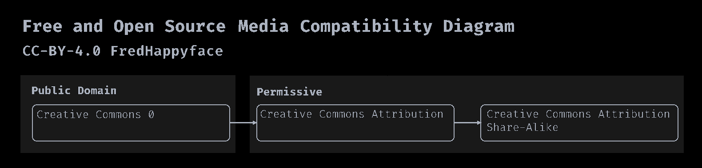</a>   |
| MediaDark   | Dark theme               | <a href="ImageOut/MediaDark.png">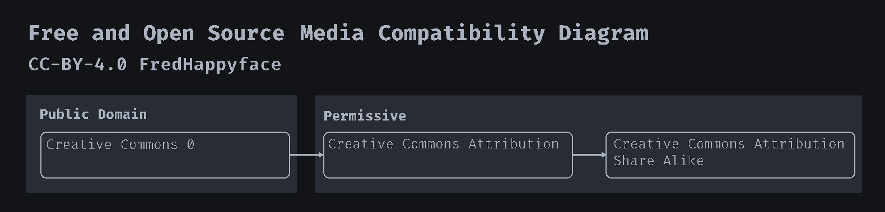</a>     |
| MediaLight  | Light theme              | <a href="ImageOut/MediaLight.png">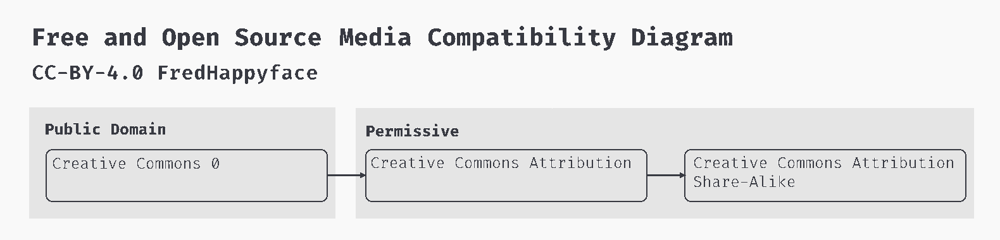</a>   |
| MediaBlackS | Black theme with sources | <a href="ImageOut/MediaBlackS.png">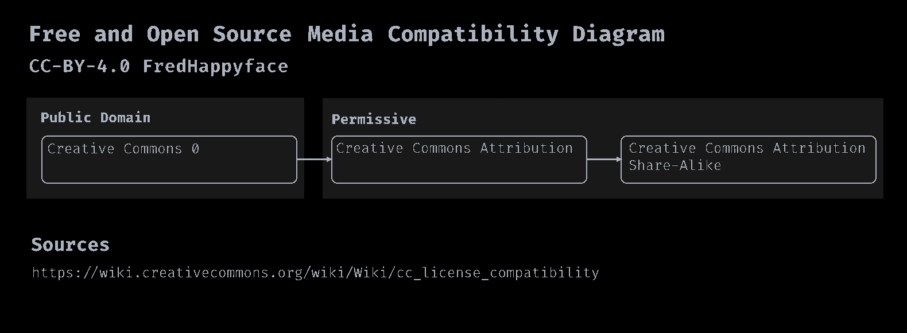</a> |
| MediaDarkS  | Dark theme with sources  | <a href="ImageOut/MediaDarkS.png">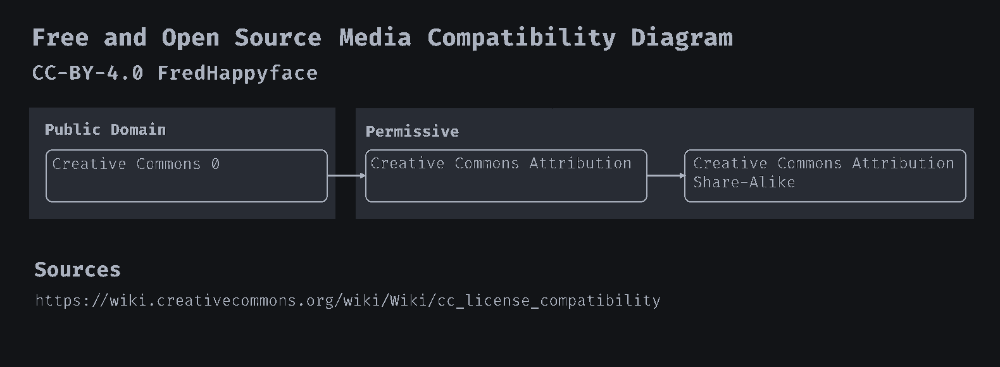</a>   |
| MediaLightS | Light theme with sources | <a href="ImageOut/MediaLightS.png">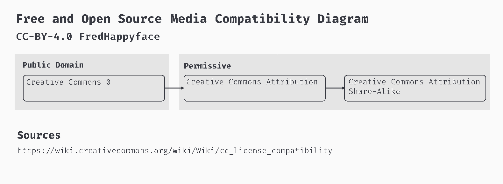</a> |

#### Sources
- https://wiki.creativecommons.org/wiki/Wiki/cc_license_compatibility

### Software
Images showing the relationship between FOSS Software licenses. assemble.py produces 6 variants:

| Name           | Description              | Preview                                                                                       |
| :------------- | :----------------------- | :-------------------------------------------------------------------------------------------- |
| SoftwareBlack  | Black theme              | <a href="ImageOut/SoftwareBlack.png">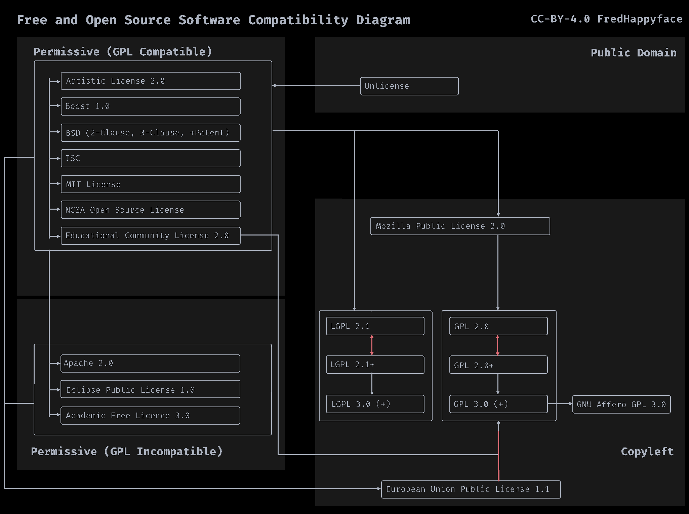</a>   |
| SoftwareDark   | Dark theme               | <a href="ImageOut/SoftwareDark.png">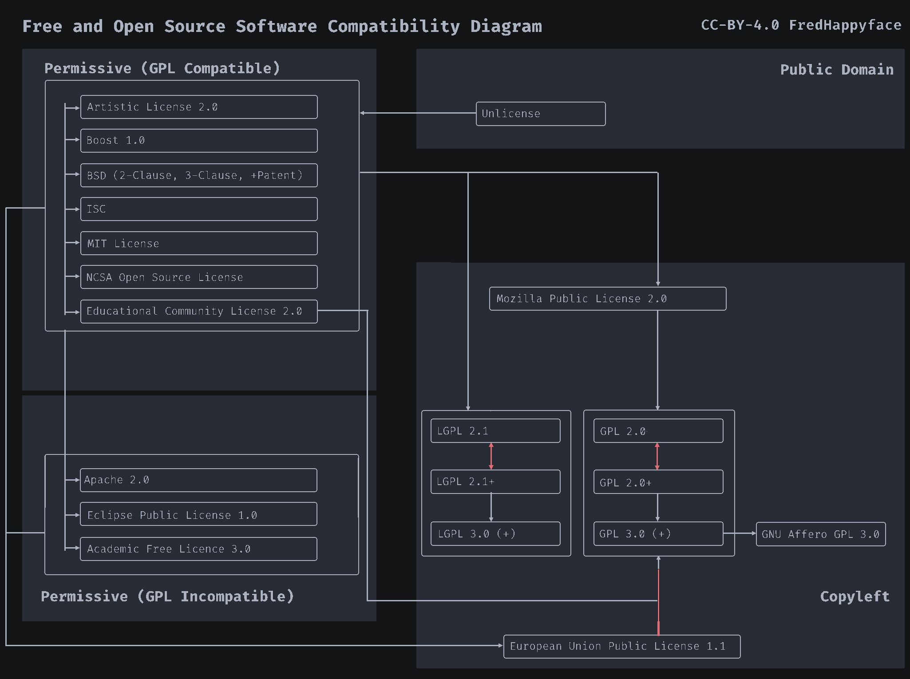</a>     |
| SoftwareLight  | Light theme              | <a href="ImageOut/SoftwareLight.png">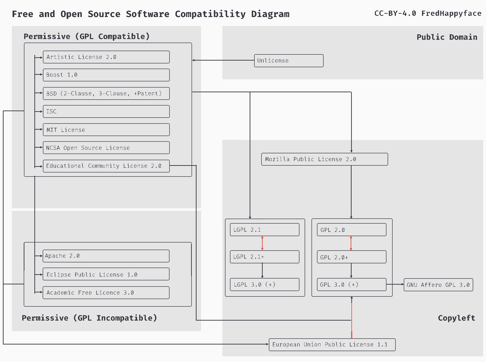</a>   |
| SoftwareBlackS | Black theme with sources | <a href="ImageOut/SoftwareBlackS.png">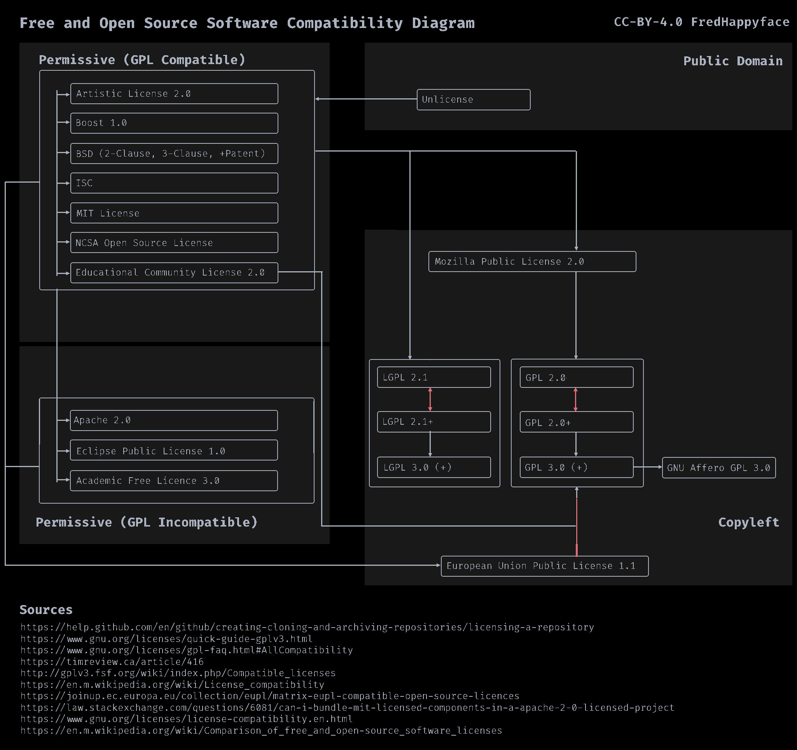</a> |
| SoftwareDarkS  | Dark theme with sources  | <a href="ImageOut/SoftwareDarkS.png">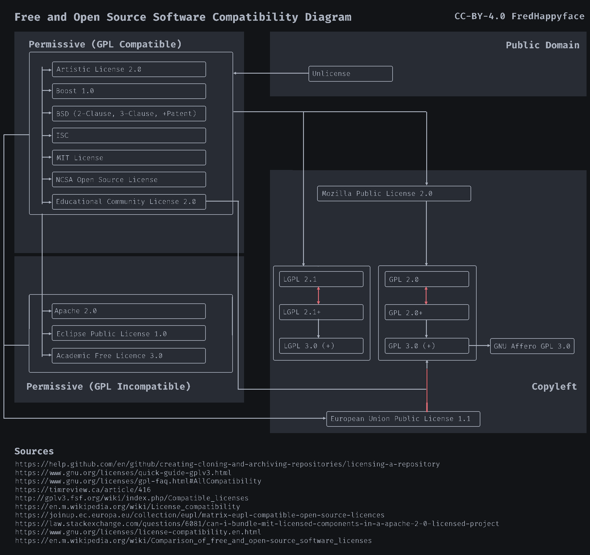</a>   |
| SoftwareLightS | Light theme with sources | <a href="ImageOut/SoftwareLightS.png">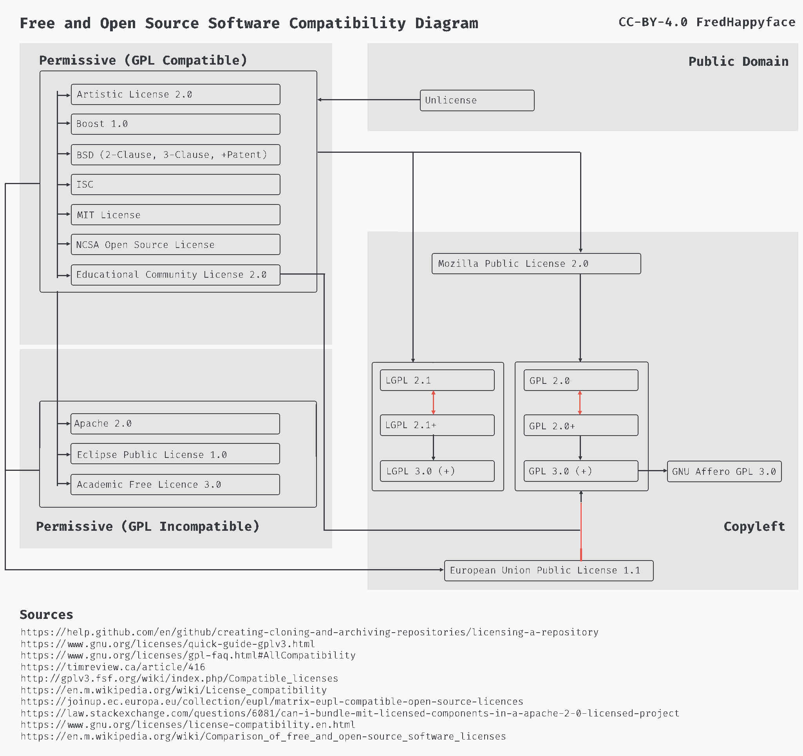</a> |


#### Sources
- https://help.github.com/en/github/creating-cloning-and-archiving-repositories/licensing-a-repository
- https://www.gnu.org/licenses/quick-guide-gplv3.html
- https://www.gnu.org/licenses/gpl-faq.html#AllCompatibility
- https://timreview.ca/article/416
- http://gplv3.fsf.org/wiki/index.php/Compatible_licenses
- https://en.m.wikipedia.org/wiki/License_compatibility
- https://joinup.ec.europa.eu/collection/eupl/matrix-eupl-compatible-open-source-licences
- https://law.stackexchange.com/questions/6081/can-i-bundle-mit-licensed-components-in-a-apache-2-0-licensed-project
- https://www.gnu.org/licenses/license-compatibility.en.html
- https://en.m.wikipedia.org/wiki/Comparison_of_free_and_open-source_software_licenses

### Choosing the right image
Entirely down to preference. Images are named in the form
\[Media|Software]\[Black|Dark|Light]\[S?]

Select the preferred theme, options are Black for OLED dark themes, Dark
for regular dark themes and Light for regular light themes.

It may be worth selecting an 'S' image if you wish to include sources but
do not wish to include them in text

## Licenses
Includes bsd+patent license.

### BSD_2_CLAUSE_PATENT
BSD-2-Clause Plus Patent License <https://opensource.org/licenses/BSDplusPatent>.
spdx.org code: BSD-2-Clause-Patent

#### Justification for another license
The bsd+patent license is a halfway-house between the MIT License and the Apache 2.0 license
#### Advantages
- Includes an express patent grant
- Short and simple
- GPL compatible

#### Disadvantages
- Lesser known
- (is not on the GitHub short-list)

## Language information
### Built for
This program has been written for Python 3 and has been tested with
Python version 3.8.0 <https://www.python.org/downloads/release/python-380/>.

Install with chocolatey
```powershell
choco install python
```
### Other versions
To install Python, go to <https://www.python.org/> and download the latest
version.
## How to run
1. Open the .py file in vscode
2. Ensure a python 3.8 interpreter is selected (Ctrl+Shift+P > Python:Select Interpreter > Python 3.8)
3. Run by pressing Ctrl+F5 (if you are prompted to install any modules, accept)


## Changelog
See the [CHANGELOG](/CHANGELOG.md) for more information.


## Download
### Clone
#### Using The Command Line
1. Press the Clone or download button in the top right
2. Copy the URL (link)
3. Open the command line and change directory to where you wish to
clone to
4. Type 'git clone' followed by URL in step 2
```bash
$ git clone https://github.com/FredHappyface/FOSSCompat
```

More information can be found at
<https://help.github.com/en/articles/cloning-a-repository>

#### Using GitHub Desktop
1. Press the Clone or download button in the top right
2. Click open in desktop
3. Choose the path for where you want and click Clone

More information can be found at
<https://help.github.com/en/desktop/contributing-to-projects/cloning-a-repository-from-github-to-github-desktop>

### Download Zip File

1. Download this GitHub repository
2. Extract the zip archive
3. Copy/ move to the desired location

## Licence
CC-BY-4.0 License
Copyright (c) FredHappyface
(See the [LICENSE](/LICENSE.md) for more information.)
